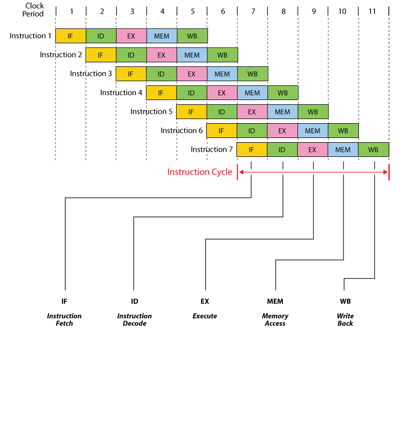
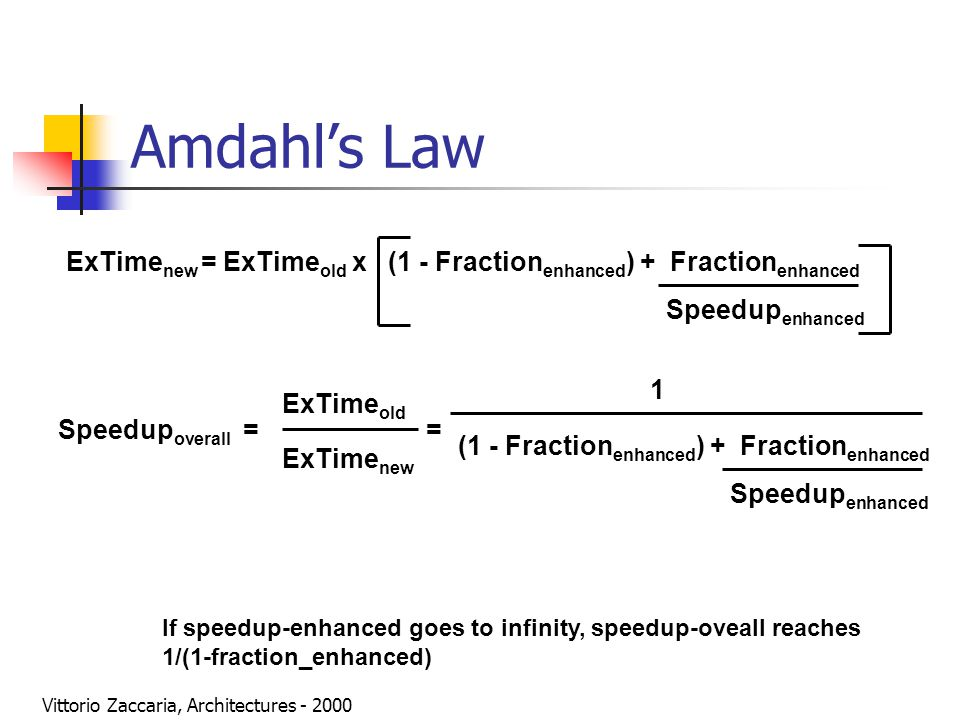

# Definição da Arquitetura do Conjunto de Instruções

- Para se obter uma arquitetura de Computadores "real"
>- Requisitos específicos para objetivo alvo da máquina e para as pessoas que vão usar;
>- Inclui: Organização (conjunto de instruções) e Hardware;
>- Restrição de mercado;
>- Portabilidade (Sobreviverá por várias gerações?)
>- O que realmente importa?
>>- Funcionamento completo do sistema: **Hardware, compilador, sistema operacional e aplicação**;
>- Projeto de uma arquitetura:
>>- Começa no nível alto -> Busca de soluções possíveis;
>>- Projeto de várias etapas;

## Pipeline

- 5 estágios;
>- IF, ID, ALU, MEM, WB;
>> 1. Busca a instrução;
>> 2. Decodifica instrução;
>> 3. Operações aritméticas;
>> 4. Acesso à memória;
>> 5. Escreve no registrador;

- Hazards (Conflitos):
>- **Estrutural:** Instruções diferentes precisam do mesmo hardware ao mesmo tempo;
>- **Dados:** A instrução precisa da execução prévia de uma instrução que ainda está no pipeline;
>- **Controle:** Decisão de fluxo do código (para qual ponto deve ir);

## Memória

- Organizada hierarquicamente, devido as diferenças de velocidade e preço entre as unidades;
>- Memória Secundária (Disco) -> Memória principal (RAM) -> Memória Cache (L3, L2, L1) -> Registradores;

- Duas formas de hierarquização de memória:
>- **Inclusiva:** Tudo o que há no nível superior tem no inferior;
>>- Cada nível é um sub-conjunto do nível inferior em relação ao conteúdo. Assim o desempenho depende das taxas de acerto (hit rates);
>- **Exclusiva:** Alguns processsadores têm caches exclusivos - os dados podem estar no cache L1 ou L2, nunca em ambos;
>- **OBS:** Existem tipos intermediários que não requerem que os dados no cache L1 residam também no cache L2, embora possam frequentemente fazê-lo. Não há nomenclatura padrão para esse caso;

## Princípios Quantitativos:

- Explorar paralelismo:
>- A ideia é aumentar a vazão das instruções (*throughput*);

- Pricípio da Localidade:
>- Consiste na busca de informações em blocos, baseados na probabilidade de se acessar itens próximos;
>- **Localidade temporal:** Um item de memória referenciado tende a ser acessado novamente em breve;
>- **Localidade espacial:** Se um vetor é acessado na posição 1, provavelmente será acessado nas posições seguintes;

- Foco no caso comum:
>- Ao projetar deve-se favorecer o caso frequente -> A melhoria deve ser feita exatamente neste caso;
>- Senso comum deve conduzir o projeto;

- Lei de Amdahl:
>- **Ganho de velocidade (Speedup)** = `Desempenho sem melhoria/Desempenho com melhoria`;
>- **Tempo** = `TempoAntigo * ((1 - FraçãoMelhorada) + FraçãoMelhorada/Speedup) = Instruções/Programa * CPI * Segundos/Ciclos`;
>- **CPI** = somatório de `(ICi/Instruction count*CPIi)`;
>- **CPU time** = somatório `(ICi * CPIi)*Clock cycle time`

